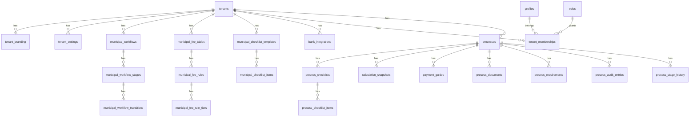

# Plataforma Municipal de Aprovacao de Projetos

## Objetivo
Transformar o SIGAPRO em uma plataforma GovTech multi-prefeitura, com configuracao institucional, workflow por municipio, motor de calculo, trilha de auditoria e operacao completa do ciclo:

1. protocolo
2. triagem documental
3. guia inicial
4. compensacao
5. analise tecnica
6. exigencias
7. reenvio
8. aprovacao
9. guia complementar / ISSQN
10. habite-se
11. conclusao

## Principios de arquitetura
- multi-tenant por prefeitura
- regras e branding por tenant
- workflow configuravel por tenant
- calculo desacoplado da interface
- RBAC por papel + nivel de acesso
- filas por setor
- auditoria integral por evento
- operacao presencial e digital no mesmo dominio

## Modulos principais

### 1. Cadastro institucional da prefeitura
Responsavel por:
- nome oficial
- brasao/logo
- secretaria e diretoria
- endereco e contatos
- identidade visual
- textos institucionais
- modelos de cabecalho/rodape
- modelos PDF / documentos oficiais

### 2. Motor de fluxo
Responsavel por:
- etapas do processo
- ordem do fluxo
- validacoes por etapa
- transicoes permitidas
- setores responsaveis
- acoes automaticas e manuais
- filas por setor

### 3. Modulo de checklist tecnico
Responsavel por:
- checklist por tipo de processo
- itens tecnicos editaveis
- status por item: de_acordo, apresentar, corrigir
- observacoes
- encaminhamento
- assinatura / responsavel

### 4. Modulo de tabelas e valores
Responsavel por:
- taxas por prefeitura
- regras por tipo de obra
- regras por area / faixa de m2
- ISSQN por tipo de incidencia
- valores fixos
- aliquotas
- configuracoes por categoria profissional

### 5. Motor de calculo
Responsavel por:
- guia inicial
- guia complementar
- ISSQN
- aprovacao
- habite-se
- parcelamento
- faixas progressivas
- combinacao de regras

### 6. Modulo financeiro e guias
Responsavel por:
- emissao de guias
- segunda via
- linha digitavel
- codigo de barras
- PIX / QR Code
- retorno bancario
- baixa manual / automatica

### 7. Integracao bancaria
Responsavel por:
- banco conveniado
- convenio
- carteira
- parametros CNAB / API
- retorno bancario
- conciliacao
- PIX

### 8. Perfis e permissoes
Papéis esperados:
- profissional_externo
- proprietario_consulta
- atendimento_balcao
- analista
- fiscal
- financeiro
- topografia
- expediente
- prefeitura_admin
- master_admin

### 9. Filas de trabalho
Filas esperadas:
- protocolo
- triagem
- exigencias
- analise
- financeiro
- habite-se
- aprovacao_final

### 10. Auditoria
Responsavel por:
- criacao de processo
- mudanca de etapa
- emissao e baixa de guias
- bloqueios
- exigencias
- checklist
- mensagens e despachos

## Entidades de banco recomendadas

### Institucional
- tenants
- tenant_branding
- tenant_settings
- municipal_document_templates
- municipal_pdf_templates

### Workflow
- municipal_workflows
- municipal_workflow_stages
- municipal_workflow_transitions
- municipal_work_queues
- process_stage_history
- process_assignments

### Checklists
- municipal_checklist_templates
- municipal_checklist_items
- process_checklists
- process_checklist_items

### Valores e calculo
- municipal_fee_tables
- municipal_fee_rules
- municipal_fee_rule_tiers
- calculation_snapshots

### Financeiro
- payment_guides
- bank_integrations
- bank_return_batches
- bank_return_entries

### Processo
- processes
- process_parties
- process_documents
- process_requirements
- process_messages
- process_signatures
- process_movements
- process_audit_entries

### Usuarios e RBAC
- profiles
- roles
- permissions
- role_permissions
- tenant_memberships

## Relacoes principais

## Estrutura de telas

### Master Admin
- carteira de prefeituras
- usuarios globais
- modulos ativos
- contratos
- indicadores gerais

### Administrador da prefeitura
- dashboard municipal
- usuarios e permissoes
- identidade institucional
- workflow
- filas
- tabelas e valores
- integracao bancaria
- modelos PDF

### Atendimento / Balcao
- novo protocolo presencial
- consulta de protocolos
- recepcao documental

### Analista
- fila de analise
- checklist tecnico
- exigencias
- despacho

### Financeiro
- guias emitidas
- compensacao
- baixa manual
- retorno bancario
- ISSQN

### Profissional externo
- dashboard de acompanhamento
- novo protocolo
- upload documental
- exigencias
- pagamentos

## Fluxo por perfil

### Profissional externo
1. acessa painel
2. cria novo protocolo
3. anexa documentos
4. protocola
5. acompanha exigencias, guias e status

### Atendimento / protocolo
1. recebe protocolo presencial ou digital
2. confere dados minimos
3. encaminha para triagem / guia inicial

### Financeiro
1. emite guia
2. acompanha baixa
3. reemite ou cancela
4. libera processo apos compensacao

### Analista
1. recebe processo na fila
2. executa checklist
3. gera exigencias ou aprova
4. encaminha para fase seguinte

### Administrador da prefeitura
1. configura workflow
2. configura checklist
3. configura valores
4. gerencia usuarios
5. acompanha operacao

## Componentes tecnicos principais

### Engines
- `workflowEngine`
- `calculationEngine`
- `bankSettlementEngine`
- `checklistEngine`

### Componentes de UI
- `WorkflowStageBoard`
- `TechnicalChecklistPanel`
- `FeeTableManager`
- `QueueBoard`
- `PaymentGuidePanel`
- `BankIntegrationCard`

## Estrategia de implementacao

### Fase 1
- consolidar entidades multi-tenant
- workflow configuravel por tenant
- tabelas de valores por tenant
- checklist tecnico digital

### Fase 2
- financeiro completo
- guias
- ISSQN
- retorno bancario
- baixa automatica

### Fase 3
- habite-se
- modelos PDF
- automacoes por etapa
- integracoes externas

## Observacoes
- o projeto atual ja possui base de tenants, branding, processos, documentos, guias e perfis
- a evolucao correta e expandir o dominio existente, nao refazer tudo
- workflow e calculo devem ficar desacoplados das telas para permitir customizacao por prefeitura
